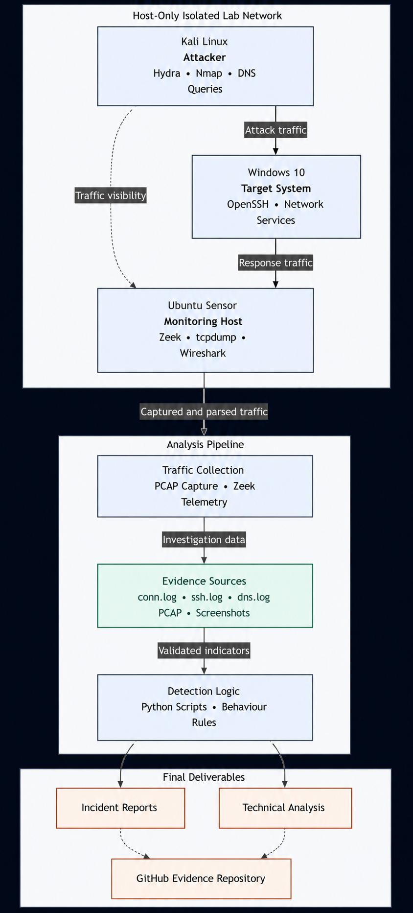

# 📖 Project Overview

This project demonstrates how a Security Operations Center (SOC) analyst investigates network attacks using Zeek, Wireshark, tcpdump, and Python. A virtual lab was built to simulate attacks, capture network traffic, analyze logs, and automate threat detection through custom detection scripts.

---

# 🎯 Objectives

- Simulate real-world cyber attacks in a controlled environment.
- Capture and analyze network traffic.
- Investigate Zeek logs for malicious activities.
- Build custom Python-based threat detection scripts.
- Perform SOC-style incident investigation and reporting.

---

# 🏗️ Lab Architecture

<p align="center">

</p>

---

# 💻 Lab Environment

| Machine | Role |
|----------|------|
| Kali Linux | Attacker |
| Ubuntu | Zeek Monitoring Server |
| Windows 11 | Target Machine |

**Network Mode:** Host-Only Network

---

# 🛠️ Tools & Technologies

- Zeek
- Wireshark
- tcpdump
- Python
- Hydra
- Nmap
- VMware Workstation
- Ubuntu
- Kali Linux
- Windows 11

---

# 📂 Project Structure

```text
zeek-threat-detection-lab/
│
├── Analysis/
├── Detection-Scripts/
├── Images/
├── Incident-Reports/
├── Logs/
├── PCAP/
├── Screenshots/
├── Zeek-Logs/
├── Architecture.md
├── README.md
└── LICENSE
```

---

# 🔄 Detection Workflow

<p align="center">


</p>

```
Attack Simulation
        │
        ▼
Packet Capture (tcpdump)
        │
        ▼
Zeek Log Generation
        │
        ▼
Traffic Investigation
        │
        ▼
Python Detection Scripts
        │
        ▼
Incident Report
```

---

# ⚔️ Attack Simulations

---

## 1️⃣ SSH Brute Force Detection

**Attack Tool:** Hydra

### Attack Execution

<p align="center">


</p>

### Zeek Log Analysis

<p align="center">

</p>

### SSH Authentication Analysis

<p align="center">

</p>

### Wireshark Analysis

<p align="center">

</p>

### Python Detection

<p align="center">

</p>

---

## 2️⃣ TCP SYN Port Scan Detection

**Attack Tool:** Nmap

### Attack Execution

<p align="center">

</p>

### Zeek Connection Analysis

<p align="center">

</p>

### Wireshark Investigation

<p align="center">

</p>

### Python Detection

<p align="center">

</p>

---

## 3️⃣ DNS Anomaly Detection

### DNS Query Generation

<p align="center">

</p>

### Zeek DNS Analysis

<p align="center">

</p>

### Python Detection

<p align="center">

</p>

---

# 📊 Key Features

- SOC-oriented attack simulation
- Network packet capture using tcpdump
- Zeek log investigation
- Wireshark packet analysis
- SSH brute-force detection
- TCP SYN port scan detection
- DNS anomaly detection
- Custom Python detection scripts
- Incident reporting
- Professional GitHub documentation

---

# 📁 Important Zeek Logs

- conn.log
- ssh.log
- dns.log

---

# 🧠 Skills Demonstrated

- Network Traffic Analysis
- Security Monitoring
- Threat Detection
- Zeek Log Analysis
- Wireshark Investigation
- Packet Capture
- Python Automation
- Incident Response
- Blue Team Operations
- SOC Analysis

---

# 🚀 Future Improvements

- HTTP Traffic Analysis
- Malware Traffic Detection
- SIEM Integration (Wazuh / Elastic)
- Email Alerting
- Real-time Detection Dashboard
- MITRE ATT&CK Mapping

---

# 📜 License

This project is released under the MIT License.

---

# 👨‍💻 Author

**Ashiwan**

Cybersecurity Enthusiast | SOC Analyst Aspirant | Python | Network Security
